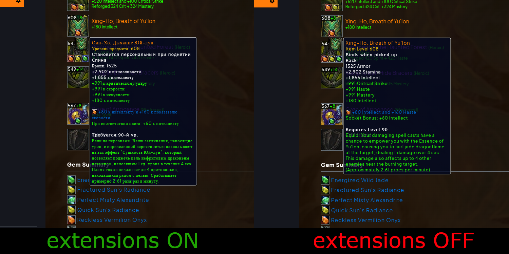
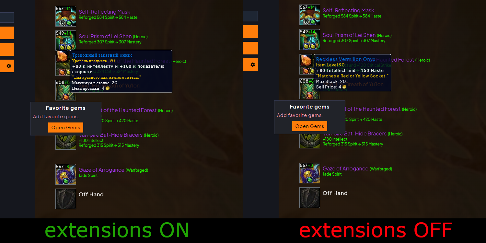
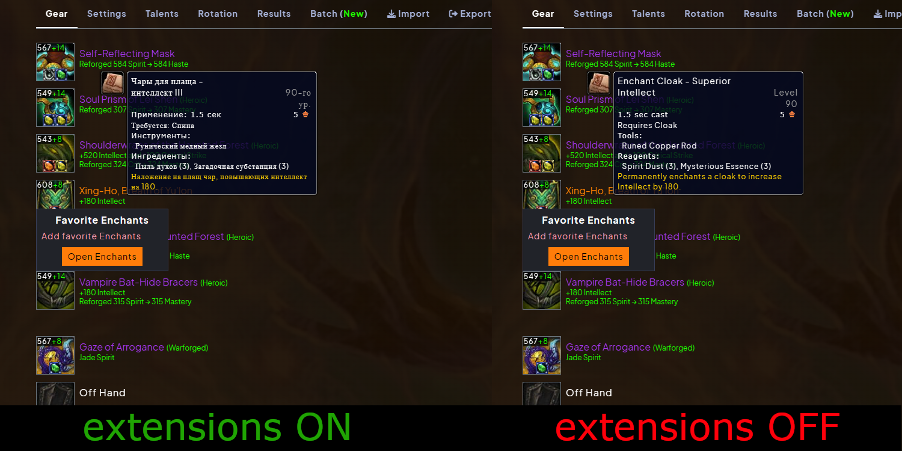

# Wowsims.translate.ru

Браузерное расширение для перевода тултипов на сайте **https://www.wowsims.com** на русский язык через ru.wowhead.com.

## Установка

### Скачать ZIP архив, распоковать в удобную вам папку.

### Для Yandex Browser:
1. Открой `browser://extensions/`
2. Включи **«Режим разработчика»** (переключатель в правом верхнем углу).
3. Нажми **«Загрузить распакованное расширение»**.
4. Выбери папку с распакованным расширением.

### Для Google Chrome:
1. Открой `chrome://extensions/`
2. Включи **«Режим разработчика»** (переключатель в правом верхнем углу).
3. Нажми **«Загрузить распакованное расширение»**.
4. Выбери папку с распакованным расширением.

### Для Firefox:
  В разработке

## Как работает
- Автоматически заменяет тултипы Wowhead на русские (item, spell, enchant и т.д.).
- Поддерживает динамическое обновление страницы.

## Пример работы
### Экипировка / Equipment

### Гемы / Gems

### Чанты / Enchants

---

**Версия:** 1.0.0
**Статус:** Работает с экипировкой, чарами и гемами.
